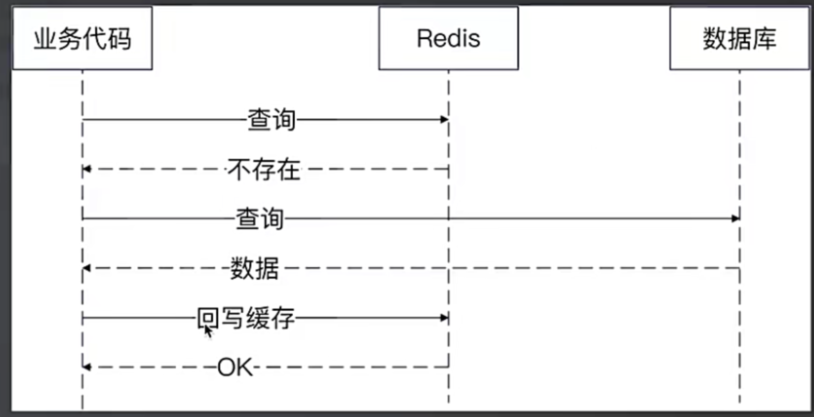

# Webook

Webook小微书（仿小红书）

- DDD 框架：Domin-Drive Design

    

项目启动：
- 前端：在 webook-fe 目录下，执行 `npm run dev`
- 后端：在 webook 目录下，执行 `go run main.go`
- 数据库：在 webook 目录下，执行 `docker compose up`
  - 执行 `docker compose down` 会删除数据库，结束 `docker compose up` 进程不会

## 流程记录

### 注册功能

1. Bind 绑定请求参数，绑定到结构体 UserSignUpReq
2. 用正则表达式校验邮箱和密码格式
3. 确认密码和密码一致
4. 调用 service 层进行注册
5. 返回注册成功

> 跨域请求：
>
> 项目是前后端分离的，前端是 Axios，后端是Go，所以需要跨域请求。
>
> - 跨域请求：协议、域名、端口有一个不同，就叫跨域
> - Request Header 和 Response Header 中的字段要对应上
> - 采用 middleware 中间件进行跨域请求
>
> docker compose 安装数据库
>
> - 静默启动；
>
>     ```bash
>      docker compose up -d
>     ```
>
> - `docker compose up` 初始化 docker compose 并启动
>
> - `docker compose down` 删除 docker compose 里面创建的各种容器，数据库
>
> - 只要不 down 数据库一直都在
>
> DDD 框架：Domin-Drive Design
>
> - Domain: 领域，存储对象
> - Repository: 数据存储
> - Service: 业务逻辑

### 登录功能

登录功能分为两件事：
- 实现登录功能
- 登录状态的校验

登录功能：

1. 绑定请求参数，绑定到结构体 UserLoginReq
2. 在 service 层中，根据邮箱查询用户是否存在，密码是否正确
3. 返回登录结果

登录状态的校验：
- 利用 Gin 的 session 插件，从 cookie 中获取 sessionID，校验登录状态
- 采用 Cookie 和 Session 进行登录状态的保持
- 接入 JWT 后，采用 JWT Token 和 Token Refresh 进行登录状态的保持
- 

> Cookie：
> - Domain：Cookie 可以在什么域名下使用
> - Path：Cookie 可以在什么路径下使用
> - Expires/Max-Age：Cookie 的过期时间
> - HttpOnly：Cookie 是否可以通过 JS 访问
> - Secure：Cookie 是否只能通过 HTTPS 访问
> - SameSite：Cookie 是否只能在同一个站点下使用

> Session：
> - 存储在服务器端
> - 通过 SessionID 来识别用户
> - 一般通过 Cookie 来传递 SessionID
>
> Redis：
> - 用户数据存储在 Redis 中
>
> LoginMiddlewareBuilder：
> - 登录中间件，用于校验登录状态
> - 通过 IgnorePaths 方法，设置不校验登录状态的路径
> - 通过 Build 方法，构建中间件: 链式调用
>
> Debug 定位问题：
> 倒排确定：http 发送请求，中间件，业务逻辑，数据库
> F12 查看错误信息
> 后端看日志
>
> Session 的过期时间：
> - 通过中间件 LoginMiddlewareBuilder 设置，当访问不在 IgnorePaths 的路径时，会更新 Session 的 update_time 字段
> - 同时更新 Session 的过期时间 MaxAge
> - 但每次访问都要从 Redis 中获取 Session，性能较差（所以后面引入 JWT）
>
> 接入 JWT：
> - 在 Login 方法中，生成 JWT Token，并返回给前端 x-jwt-token
> - 跨域中间件 设置 x-jwt-token 为 ExposeHeaders
> - Middleware 中，解析 JWT Token，验证 signature
> - 前端要携带 x-jwt-token 请求
> - 实现 JWT Token 的刷新，长短 token 的过期时间不同，多实例部署时，需要考虑 token 的过期时间
>
> 登录安全
> - 限流，采用滑动窗口算法：一分钟内最多 100 次请求- 
> - 检查 userAgent 是否一致

### Kubernets 入门

Pod: 实例
Service: 服务
Deployment: 管理 Pod

准备 Kubernetes 容器镜像：

- 创建可执行文件 `GOOS=linux GOARCH=arm go build -o webook .`
- 创建 Dockerfile，将可执行文件复制到容器中，并设置入口点
- 在命令行中登录 Docker Hub，`docker login`
- 构建容器镜像：`docker build -t techselfknow/webook:v0.0.1 .`

删除工作负载 deployment， 服务 service， 和 pods：

- 删除s Deployment：`kubectl delete deployment webook`
- 删除 Service：`kubectl delete service webook`
- 删除 Pod：`kubectl delete pod webook`

Deployment 配置：

- 创建 k8s-webook-deployment.yaml 文件
- 在命令行中执行 `kubectl apply -f k8s-webook-deployment.yaml`
- 查看 Deployment 状态：`kubectl get deployment`
- 查看 Pod 状态：`kubectl get pod`
- 查看 Service 状态：`kubectl get service`
- 查看 Node 状态：`kubectl get node`

> Deployment 配置：
> - replicas: 副本数,有多少个 pod
> - selector: 选择器
>   - matchLabels: 根据 label 选择哪些 pod 属于这个 deployment
>   - matchExpressions: 根据表达式选择哪些 pod 属于这个 deployment
> - template: 模板，定义 pod 的模板
>   - metadata: 元数据，定义 pod 的元数据
>   - spec: 规格，定义 pod 的规格
>     - containers: 容器，定义 pod 的容器
>       - name: 容器名称
>       - image: 容器镜像
>       - ports: 容器端口
>         - containerPort: 容器端口
>

Service 配置：

- 创建 k8s-webook-service.yaml 文件，采用 LoadBalancer 类型
- 在命令行中执行 `kubectl apply -f k8s-webook-service.yaml`
- 查看 Service 状态：`kubectl get service`

> Service 中的端口(`spec.ports.targetPort`)和 Deployment 中的端口(`spec.containers.ports.containerPort`)对应关系, main.go 中配置的端口(`server.Run(":8080")`) 要保持一致.

k8s 中 mysql 配置：


```bash
webook main* ❯ kubectl get services                   
NAME           TYPE           CLUSTER-IP       EXTERNAL-IP   PORT(S)          AGE
kubernetes     ClusterIP      10.96.0.1        <none>        443/TCP          38h
webook-mysql   LoadBalancer   10.101.251.206   localhost     3309:32695/TCP   18s
```

区分服务端口和容器端口：
- 服务端口 port：外部访问的端口
- 容器端口 targetPort：容器内部监听的端口
- ```yaml
  ports:
    - protocol: TCP
      port: 3309
      targetPort: 3306
  ```

k8s 中 mysql 持久化存储配置：

- 创建 k8s-mysql-deployment.yaml 文件
- 创建 k8s-mysql-pv.yaml 文件
- 创建 k8s-mysql-pvc.yaml 文件
- 在命令行中执行 `kubectl apply -f k8s-mysql-pv.yaml`
- 在命令行中执行 `kubectl apply -f k8s-mysql-pvc.yaml`
- 在命令行中执行 `kubectl apply -f k8s-mysql-deployment.yaml`

持久化之后，mysql 数据存储在 `/mnt/data` 目录下，而不是在容器中。
删除 Deployment 后，mysql 数据不会丢失，因为数据存储在 PV 中。
重新创建 Deployment 后，mysql 数据会从 PV 中恢复。

> 持久化存储：
> - PV: 持久化卷，物理存储
> - PVC: 持久化卷声明，逻辑存储
> - 持久化存储的挂载路径：/var/lib/mysql （mysql 数据存储路径）

配置 mysql 的 k8s 环境

```yaml
spec:
  selector:
    app: webook-mysql
  ports:
    - protocol: TCP
      # 服务端口, 外部访问的端口
      port: 11309
      # 容器端口, 容器内部监听的端口
      targetPort: 3306
      # type 为 NodePort 时, 需要指定 nodePort
      # 指定 nodePort 后, 可以通过 nodeIP:nodePort 访问服务
      nodePort: 30002
  type: NodePort
```


port (Service 端口):

- 这是 Service 暴露给 Kubernetes 集群内部其他 Pod 或 Service 的端口。
- 当集群内部的 Pod 需要访问这个 Service 时，它们会使用这个端口。
- 在上面的 YAML 示例中，port: 11309 表示 Service 会在 11309 端口上监听连接请求。
- 客户端（在集群内部）访问 Service 时，会使用这个端口进行连接。
- 注意： 这个端口仅在 Kubernetes 集群内部使用。

targetPort (Pod 端口):

- 这是 Service 将请求转发到的目标 Pod 的端口。
- targetPort 通常与 Pod 中运行的容器监听的端口一致。
- 在上面的 YAML 示例中，targetPort: 3306 表示 Service 会将连接请求转发到目标 Pod 的 3306 端口，即你的 MySQL 容器内部监听的端口。
- 通常，你的 MySQL 服务（或者其他应用程序）在容器内部会监听这个端口。
- 注意： 在 Kubernetes 中，Pod 内部的端口号是相对于 Pod 内部的网络命名空间而言的。

nodePort (Node 端口):

- 这是当你的 Service type 设置为 NodePort 时，Kubernetes 集群中每个节点的 IP 地址上都会暴露的端口。
- 当你需要从 Kubernetes 集群外部访问你的 Service 时，可以使用节点的 IP 地址和这个 nodePort 进行访问。
- 在上面的 YAML 示例中，nodePort: 30002 表示 Kubernetes 会在所有节点的 IP 地址上开启 30002 端口，并将发送到这个端口的流量转发到 Service。
- 客户端（在集群外部）可以通过节点的 IP 地址和 nodePort 连接到服务。
- 注意： NodePort 的端口号通常在 30000-32767 之间，并且必须是唯一的。
- 在上面的 YAML 示例中，nodePort: 30002 表示 Kubernetes 会在所有节点的 IP 地址上开启 30002 端口，并将发送到这个端口的流量转发到 Service。
- 客户端（在集群外部）可以通过节点的 IP 地址和 nodePort 连接到服务。
- 注意： NodePort 的端口号通常在 30000-32767 之间，并且必须是唯一的。
- 注意： 使用 NodePort 时，你仍然需要访问 Kubernetes 集群节点来访问服务。它并不直接将端口暴露到互联网上。

### WRK 压测

- 安装 wrk：`brew install wrk`
- 压测：`wrk -t4 -c100 -d10s -s ./scripts/signup.lua http://localhost:8080/users/signup`
  - -t4：4 个线程
  - -c100：100 个连接
  - -d10s：10 秒
  - -s ./scripts/signup.lua：lua 脚本
  - http://localhost:8080/users/signup：请求路径

> 如何在测试中维护登录状态：
> - 在初始化中模拟登录，拿到对应的登录态的 cookie
> - 手动登录，复制对应的 cookie，在测试中使用

### Redis 缓存优化



查询用户时，先从 Redis 缓存中查询，如果缓存中没有，则从数据库中查询，并将查询结果缓存到 Redis 中。
- 缓存中的 user 是 domain.User，数据库中的 user 是 dao.User，从数据库查询到 user 后，需要将 dao.User 转换为 domain.User
- 数据库限流：数据库限流，防止缓存击穿后，数据库压力过大
- 缓存失败：属于偶发事件，从数据库中查询到用户，但缓存失败，此时我们打日志，做监控，不返回错误。


